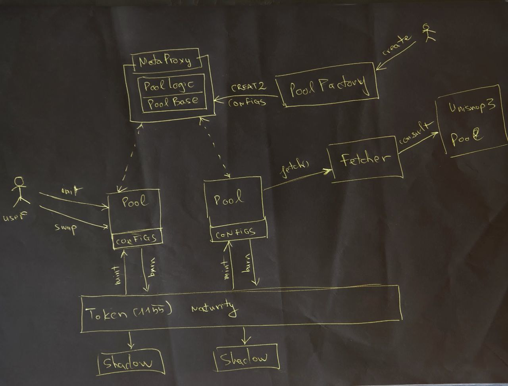

# Derivable Audit Techspec

## Project Overview

Derivable is an AMM Protocol for the creation of compound leverage perpetual pools. It lets anyone create perpetual pools tracking any index value, with different configs. Users can interact with those pools to gain compound leverage of each index value, from 3 sides: long, short and liquidity.

Liquidity providers can provide liquidity to each pool to gain interest, premium, open fee and price spread from pool activities.

Long user can lock reserve token into the pool to open Long position and will either:
* earn leveraged profit when the pool index value is increased
* take leveraged loss when the pool index value is decreased

Short user can do the same as Long user to gain reverse exposure to the index price.

The leverage of Long and Short derivatives are continously compounding, (in contrast to linear leverage of conventional perpetual exchanges), so they have the following properties:
* No liquidation.
* Higher profit on the right side.
* Lower loss on the wrong side.

## 1. Functional Requirements
### 1.1. Roles
Contract Roles:
+ PoolFactory: allow to create new Pool with unique configurations.
+ Pool: allow to mint and burn its own ERC-1155 Token's id.

Permissioned Role:
+ Descriptor Setter: authorized to change the Token descriptor view-only contract.

Permissionless Roles:
+ Creator: create the pool (earns no benefit).
+ Initiator: init the pool state and reserve (earns no benefit).
+ Liquidity Provider: provide liquidity to each pool to gain interest, premium, open fee and price spread from pool activities.
+ Trader (Long/Short): open and close positions to gain exposure to either side of the index change.

### 1.2. Features
Derivable has the following features (for everyone):
+ Create perpetual pool for any Uniswap V3 pool with default fetcher.
+ Create perpetual pool for any index value with custom Fetcher contract.
+ Pools can be created with the different configs including: index, leverage, reserve token, interest rate, premium rate, maturity and open rate.
+ Lock reserve token to the pool to provide Liquidity.
+ Lock reserve token to the pool to open Long position.
+ Lock reserve token to the pool to open Short position.
+ Withdraw reserve token to remove Liquidity.
+ Withdraw reserve token to close Long position.
+ Withdraw reserve token to close Short position.

### 1.3 Use Cases

1. Alice wants to go long on the token `FOO` with some leverage. She opens a LONG x4 `FOO/ETH` position using 1.0 `ETH`.
   * When the price of `FOO/ETH` increases by 10%, she expects to receive 1.4641 `ETH` upon closing the position, resulting in a net profit of 46.41% due to the effect of compounding leverage.
   * When the price of `FOO/ETH` decreases by 10%, she expects to receive 0.6561 `ETH` upon closing the position, resulting in a net loss of 34.39% due to the effect of compounding leverage.
   * In the event that the price of `FOO/ETH` crashes to near 0, she expects to receive some small `ETH` back upon closing the position, without being liquidated, thanks to the effect of compounding leverage.

2. Bob wants to go short on the token `FOO` with some leverage. He opens a SHORT x2 `FOO/ETH` position using 2.0 `ETH`.
   * When the price of `FOO/ETH` increases by 1%, he expects to receive 1.9602 `ETH` upon closing the position, resulting in a net loss of 1.99% due to the effect of compounding leverage.
   * When the price of `FOO/ETH` decreases by 1%, he expects to receive 2.0402 `ETH` upon closing the position, resulting in a net profit of 2.01% due to the effect of compounding leverage.
   * In the event that the price of `FOO/ETH` increases to infinity, he expects to receive some small `ETH` back upon closing the position, without being liquidated, thanks to the effect of compounding leverage.

3. Alice and Bob leveraged positions are only possible when the `FOO/ETH` is in perfect balance between the 2 sides, for any difference between the 2 sides, additional liquidity is required. Charlie want to earns some interest and premium by providing additional liquidity to `FOO/ETH` pool. Charlie provide 1.0 `ETH` as pool liquidity.
    * When the price of `FOO/ETH` does not change , Charlie expects to receive more than 1.0 ETH upon removing the liquidity position due to the interest he earned for the time he provided the liquidity. 
    * The longer he keeps the liquidity in the pool, the more interest he earns.

4. Dan wants to earns some interest and premium from `BAR/ETH` pool, but the pool does not exist. He then uses the protocol `Factory` to construct and init a new pool using an Uniswap v3 `BAR/ETH` pair as the oracle, even through he's a nobody. After the initialization, Dan and Charlie and everyone can provide liquidity to the new pool without any restriction.

## 2. Technical Requirements
This project has been developed with Solidity language, using Hardhat as a
development environment. Typescript is the selected language for testing and
scripting.

In addition, the following libraries are used in the project. All
information about the contracts library and how to install it can be found in
their GitHub.
* `ABDKMath64x64` by [ABDK Consulting](https://github.com/abdk-consulting).
* `FullMath` and `OracleLibrary` by [Uniswap](https://github.com/Uniswap)
* `MetaProxyFactory` from [ERC-3448](https://eips.ethereum.org/EIPS/eip-3448#reference-implementation)
* `BytesLib` from [solidity-bytes-utils](https://github.com/GNSPS/solidity-bytes-utils)
* [OpenZeppelin](https://github.com/OpenZeppelin)

In the project folder, the following structure is found:
```
.
├── contracts
│   ├── interfaces
│   │   ├── IHelper.sol
│   │   ├── IPoolFactory.sol
│   │   ├── IPool.sol
│   │   ├── ITokenDescriptor.sol
│   │   ├── IToken.sol
│   │   └── IWeth.sol
│   ├── libs
│   │   └── MetaProxyFactory.sol
│   ├── subs
│   │   ├── Constants.sol
│   │   └── Storage.sol
│   ├── support
│   │   ├── CompositeFetcher.sol
│   │   ├── FeeReceiver.sol
│   │   ├── Helper.sol
│   │   ├── MetaProxyView.sol
│   │   ├── TokenDescriptor.sol
│   │   ├── TokenPriceView.sol
│   │   └── View.sol
│   ├── test
│   │   └── *.sol
│   ├── Fetcher.sol
│   ├── PoolBase.sol
│   ├── PoolFactory.sol
│   ├── PoolLogic.sol
│   └── Token.sol
├── scripts
│   └── *.js
├── test
│   └── *.test.js
├── coverage.json
├── hardhat.config.js
├── LICENSE
├── package.json
├── README.md
├── TECHSPEC.md
└── yarn.lock
```

Start with README.md to find all basic information about project structure
and scripts that are required to test and deploy the contracts.

In the ./tests folder, *.ts provides the tests of the
different methods of the main contract, in Typescript. In shared, different
test helpers are found.

The main contract can be deployed using various scripts in ./scripts. In
order to do so, .env.example must be renamed .env, and all required data must
be provided.

The project configuration is found in hardhat.config.ts, where dependencies
are indicated. Mind the relationship of this file with .env. A basic
configuration of Polygon’s Mumbai testnet is described in order to deploy the
contract. And an etherscan key is set to to configure its different
functionalities directly from the repo. More information about this file’s
configuration can be found in the Hardhat Documentation.

Finally, this document can be found in ./docs.

### 2.1. Architecture Overview
The following chart provides a general view of the TokenVesting contract
structure and interactions between different functions.



### 2.2. Contract Information
This section contains detailed information (their purpose, assets, functions,
and events) about the contracts used in the project.

#### 2.2.1. Token

An ShadowFactory and ERC1155-Maturity is used by all Derivable pools for their derivative tokens, but also open to any EOA or contract by rule: any EOA or contract of `<address>`, can mint and burn all its ids that end with `<address>`.

#### 2.2.2. PoolFactory

Factory contract to deploy Derivable pool using ERC-3448.

#### 2.2.3. Fetcher

An optional Fetcher contract to provide oracle fetching logic. The default fetcher is extended by the Pool code for UniswapV3 oracle. More Fetcher contract and logic can be implemented and deployed for other Oracle standards, e.g. UniswapV2, Chainlink, etc.

#### 2.2.4. PoolBase

The base logic code for state initialization and token payment of the Pool. PoolBase is extended by PoolLogic to form the Pool contract.

#### 2.2.4. PoolLogic

Mathematic and finance logic of Derivable pool, defines the state transistion calculation.

The main logic is implemented in `_swap` function which defines a single direction state transistion (1 side in and 1 side out).

A Helper contract is used for target (after) state calculation. This contract call is trustless, and provided by user.

### 2.3. Data Struture

#### 2.3.1. Pool Configs

Pool's configs are `immutable` values set by the Pool creator. The configs is cloned using MetaProxy and loaded by each function call.
* FETCHER: Custom oracle fetcher logic contract.
* ORACLE: UniswapV3 pool, QuoteTokenIndex, and TWAP's window.
* K: twice the leverage power.
* TOKEN_R: the reserve token (also the settlement currency).
* MARK: square-root of the mark (or referrent) price.
* INTEREST_HL: decay half-life for the LP interest rate (in seconds).
* PREMIUM_HL: decay half-life for the premium rate (in seconds).
* MATURITY: minimum maturity duration for new position (in seconds).
* MATURITY_VEST: the vesting duration of the maturity payoff (in seconds).
* MATURITY_RATE: the maximum payoff rate before the position is fully matured (x128).
* OPEN_RATE: the input rate when opening Long and Short position (x128).

#### 2.3.2. Storage

Pool storages are located only in `Storage.sol`

```solidity
// the last time interest is charged
uint32  internal s_lastInterestTime;

// the LONG coefficient of the pool
uint224 internal s_a;

// uint31: the last time premium is charged
// uint1: reentrant lock 
uint32  internal s_lastPremiumTime;

// the SHORT coefficient of the pool
uint224 internal s_b;
```

`s_a` and `s_b` are the 2 coefficient values for LONG and SHORT payoff of the pool.

`s_lastInterestTime` records the last time the pool interest is charged.

The highest 31 bits of `s_lastPremiumTime` records the last time the pool premium is charged.

The lowest bit of `s_lastPremiumTime` is used for re-entrancy lock.

### 2.4. Mechanism

#### 2.4.1. Reentrancy Guard

`PoolBase.init` follows the Check-Effects Interaction guideline, so it doesn't have to be locked for reentrancy.

`PoolBase.swap` uses the custom `nonReentrant` function with the lowest bit of `s_lastPremiumTime` as the lock flag.

`PoolLogic._swap` is internal, and only invoked by `PoolBase.swap`, so it's also locked for reentrancy.

#### 2.4.2. Inter-contract Interactions

`PoolBase.init` and `PoolLogic.swap` receive input payments using 2 methods:
* Token's `transferFrom(msg.sender)` which requires direct token allowance from `msg.sender`. This methos is designed for inter-contract interactions and not recommended for user interactions.
* `UTR.pay` (ERC-6120) payment, which allows UTR or other router contract with the same interface to pay the token input in a callback. The `UTR.pay` call is trustless, since both the contract address and the payload is provided by user, so the actual token received after the call is checked by the `PoolBase` code.

`PoolLogic._swap` make another trustless call to `Helper.swapToState` view function. This Helper function is provided by user, and help calculate the target (after) state for the state transition. Providing malicious or errornous Helper code cannot hurt the fund in the pool, but only hurt the transaction sender himself.

#### 2.4.3. Assets

Each pool has a single ERC-20 `TOKEN_R` configured as the reserve. It's also the settlement currency of the pool. This token is the only token that the pool holds.

Each pool can mint (and burn) 3 more ERC-1155 Token ids, represent 3 sides of the pool:
* Long ID: `0x10 + <pool-address>`
* Short ID: `0x20 + <pool-address>`
* Liquidity ID: `0x30 + <pool-address>`

ERC-1155 tokens are never be held by the pool itself. Any ERC-1155 token transferred to pool will be burnt right before the state transition is taken place.

#### 2.4.4. Getter Functions
Additionally, there are different getter functions, that can be called to
retrieve relevant data from the pool contract:
- loadConfig() → returns the immutable configs of the pool. 
- getStates() → returns the current storage values of the pool.

#### 2.4.5. Events
Derivable has the following events:
+ Pool.Swap: Emmited when there's a state transition.
+ PoolFactory.Derivable: Emmited when there's a protocol level event happens, currently only `PoolCreated` is used.

#### 2.4.6. Modifiers
Derivable has the following modifiers:
+ nonReentrant: lock the pool state for reentrancy.
+ onlyItsPool: allows only its pool to mint and burn the Token.
+ onlyDescriptorSetter: allows only an authorized setter to change the token descriptor.
